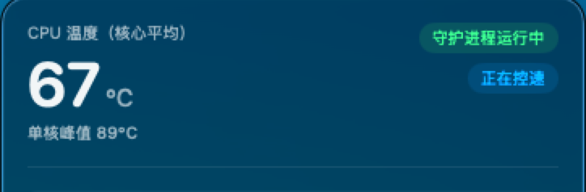
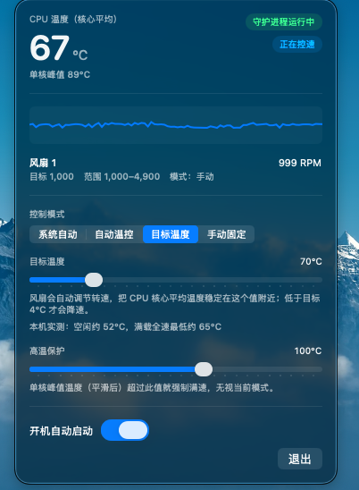

<div align="center">


# Leo 风扇控制

**让 Mac 在高负载时真的把风扇转起来。**

一个 macOS 菜单栏小工具：监控 CPU 温度与风扇转速，并按温度自动调速、或把温度闭环稳定在你指定的目标值。

[](https://github.com/nzleo/LeoMacFanControl)
[](https://github.com/nzleo/LeoMacFanControl)
[](https://github.com/nzleo/LeoMacFanControl/releases/latest)
[](LICENSE)

**[🌐 项目主页](https://nzleo.github.io/LeoMacFanControl/)** · **[⬇️ 下载最新版本](https://github.com/nzleo/LeoMacFanControl/releases/latest)**

同一作者的其他开源：
[LeoMDReader](https://nzleo.github.io/LeoMDReader/) ·
[TourBox × ChatGPT / Codex 预设分享](https://nzleo.github.io/LeoTourBoxShare/)

</div>

---

## Leo 开源系列

| 项目 | 说明 |
| --- | --- |
| [Leo 风扇控制](https://nzleo.github.io/LeoMacFanControl/) | macOS 菜单栏温控（本仓库） |
| [LeoMDReader](https://nzleo.github.io/LeoMDReader/) | 轻量 Markdown 阅读 / 编辑 |
| [TourBox × ChatGPT / Codex](https://nzleo.github.io/LeoTourBoxShare/) | TourBox 键位预设分享 |

---

## 它解决什么问题

macOS 的默认风扇策略偏保守。在 Mac mini 这类机型上，CPU 满载时系统常常**把风扇死守在最低转速**，任由温度一路爬升到芯片自己降频。

下面是 **M4 Mac mini（Mac16,10，10 核，风扇 1000–4900 RPM）** 上 10 线程满载的实测对比：

| | macOS 默认（1000 RPM） | 强制满速（4900 RPM） |
|---|---|---|
| 核心平均温度 | **超过 87°C 且持续上升** | **约 65°C**，30 秒内收敛稳定 |
| 单核峰值温度 | **超过 103°C** | 约 79°C |
| 结果 | 90 秒仍未收敛，测试被迫中止 | 稳定 |

**温差 22°C。** 风扇明明有这个能力，只是默认策略不用。这个工具就是把这部分能力交还给你。

> 空闲时不用担心吵：本机真空闲只有 52°C，所有曲线的起点都在这之上，空闲时风扇不会无谓提速。

---

## 下载与安装

### 第 1 步：下载并拖进「应用程序」

**[⬇️ 前往下载页](https://github.com/nzleo/LeoMacFanControl/releases/latest)**，下载 `LeoFanControl-*.dmg`（约 1.7 MB）。

打开 DMG，把 `LeoFanControl.app` 拖到旁边的「应用程序」文件夹。

> Apple 芯片（M1–M4）和 Intel Mac 都能用，App 是通用二进制。需要 macOS 13 或更高。

### 第 2 步：首次打开要手动放行（重要）

这个 App 没有购买 Apple 开发者证书（每年 99 美元）、也未做公证，所以**首次打开一定会被系统拦下**，提示「无法打开，因为无法验证开发者」。

这是正常的，不是文件损坏。三种放行方式，任选一种：

**方式 A（推荐，不用命令行）**
1. 在「应用程序」里找到 LeoFanControl
2. **按住 Control 键点击**它，选择「打开」
3. 弹窗里再点一次「打开」

**方式 B**

先双击一次（会被拦），然后打开 **系统设置 ▸ 隐私与安全性**，往下翻找到相关提示，点「仍要打开」。

**方式 C（命令行最快）**

```bash
xattr -dr com.apple.quarantine /Applications/LeoFanControl.app
```

### 第 3 步：找到它

打开后**不会有窗口，也不会出现在程序坞**——它是菜单栏 App。

请看屏幕**顶部菜单栏**，会多出一个风扇图标和当前温度。点击它弹出控制面板。


*长这样：风扇叶片图标 + 当前核心平均温度。横向位置取决于你装了多少菜单栏工具（图中因为状态图标较多，它被排到了最左侧），按住 Command 键拖动可以挪。*

> 找不到？先确认 App 真的在运行：`pgrep -x LeoFanControl` 有输出就说明进程活着，只是图标被挤到了菜单栏溢出区。

**到这一步已经可以监控温度和转速了，不需要任何权限。**

### 第 4 步：安装守护进程（只有要「控速」才需要）

控制风扇转速必须有 root 权限，由一个独立的小守护进程负责。DMG 里已经带了预编译的通用二进制，**不需要装 Xcode**。

打开「终端」，把 DMG 里的「守护进程（控速必需）」文件夹拖进终端窗口获取路径，然后执行（会要求输入你的登录密码）：

```bash
cd "把上面拖进来的路径粘在这里"
sudo ./install.sh
```

装好后，面板右上角会从「仅监控」变成「守护进程运行中」，这时控速模式才会真正生效。守护进程会注册为开机自启，以后重启不用再操作。



*装好之后应该是这样：绿色「守护进程运行中」表示 root 守护进程已就位，蓝色「正在控速」表示风扇当前确实由它接管。只有绿色徽标、没有蓝色的，说明还停在「系统自动」模式，去下面选一个控制模式即可。大字是核心平均温度（曲线与闭环的输入），小字是单核峰值（高温保护的输入），两者差 10–15°C 属正常。*

---

## 四种控制模式

<div align="center">



<p><em>面板实拍，运行在「目标温度」模式。右上角两个徽标说明控速确实已经生效，<br>
而风扇仍停在硬件最低的 999 RPM —— 因为 67°C 正落在 <code>[66, 70]</code> 的死区里：<br>
没超过目标就不提速，低于目标 4°C 以内也不降速，避免在目标线附近来回抽速。</em></p>

</div>

点击菜单栏图标弹出面板，控制模式有四个：

| 模式 | 行为 |
|---|---|
| **系统自动** | 交还给 macOS。默认值，最安全 |
| **自动温控** | 按温度曲线自动升降速，可选 `静音 / 均衡 / 强力降温` 三档 |
| **目标温度** | 设一个目标温度，风扇自动找到刚好压住它的转速（闭环） |
| **手动固定** | 用滑块设一个固定转速百分比 |

另有**高温保护**（85–110°C 可调，默认 100°C）：单核峰值温度超过它就强制满速，优先级高于所有模式。

以及**开机自动启动**开关。守护进程本身已是开机自启，所以即使不开 App，上次的控速配置在重启后也会自动恢复。

### 推荐用「目标温度」

这是最好用的一个模式，因为它直接对应大多数人的真实需求——「别让 CPU 超过某个温度」。

自动温控是**开环**的：它只保证「温度高就转得快」，但不保证温度最终停在哪里。而目标温度是**闭环**的，它把温度本身作为被控量：

> 设 75°C，风扇就会自己找到那个刚好压住 75°C 的转速（本机满载下约 2700 RPM）。温度降下来，转速也跟着降下来。

几个要点：

- 可设范围 **65–90°C**，默认 75°C。下限 65°C 是**物理下限**——本机实测满载 + 满速也只能压到 65°C，设得更低根本不可达。
- 温度**低于目标 4°C** 才会开始降速（死区），所以实际稳态落在 `[目标−4, 目标]` 区间里。这是刻意设计的，避免风扇在目标线附近来回抽速。
- 如果满速仍压不到目标并持续 60 秒，面板会弹出橙色警示，提示你调高目标值，而不是默默一直吹。

### 其他场景怎么选

- **想安静优先、热了再说** → `自动温控 + 静音`
- **跑长时间 AI / 编译任务** → `自动温控 + 强力降温`，或 `目标温度` 设 70°C
- **只想让它别吵** → `手动固定` 一个你能接受的百分比

> 面板顶部同时显示**核心平均温度**（大字，曲线和闭环的输入）和**单核峰值温度**（小字，高温保护的输入）。两者差 10–15°C 是 Apple 芯片的正常现象，不是读数错误。

---

## 隐私与安全

控速必须给一个进程 **root 权限**。市面上的第三方风扇软件，你无法逐行确认它拿到 root 之后还做了什么。这个工程的取舍是：

- **全部源码可逐行审计。** 只用 Apple 自带框架（IOKit / Foundation / SwiftUI / ServiceManagement / AppKit / Combine / Darwin），没有任何第三方依赖。
- **零网络代码。** 不 import 任何网络库，不发任何请求。你可以全局搜索 `URLSession`、`import Network`、`AF_INET`、`http`，结果为空。全工程只有 `AF_UNIX`（本机进程间通信）这一处 socket。
- **不启动子进程、不做动态加载。** 无 `Process`、`posix_spawn`、`dlopen`。
- **root 守护进程只做一件事**：读写 SMC 风扇键。它通过本机 Unix socket 接受固定的四条指令（设配置 / 取状态 / 探活 / 停止），不监听任何网络端口。
- **权限收敛。** socket 是 `root:admin 0660`——只有本机管理员（本来就能 `sudo` 的那些人）能下发控速指令，其他用户和沙盒进程被内核直接拒绝。
- **不信任外部输入。** 守护进程对收到的配置一律做范围夹取（转速 0–100%、保护温度 85–110°C、目标温度 65–90°C、死区 1–10°C，`NaN` 一律退回默认值）。

唯一进版本库的二进制素材是 App 图标源图 `Resources/AppIcon-source.png`。除它之外的一切（包括小尺寸图标）都是代码生成的。

---

## 已知限制

请在使用前了解这几条，都是真实存在的：

- **苹果没有公开的风扇控制 API。** 控速靠读写 SMC 私有接口。**个别机型 macOS 会拒绝交出控制权**，此时 App 仍可正常监控，面板会明确显示失败原因，不会静默失效。
- **Intel 的温控曲线未经实机校准。** 控制点是在 M4 Mac mini 上实测出来的，Intel 温度量级完全不同。Intel 用户建议**先用「手动固定」确认风扇确实响应**，再切自动模式。[欢迎回报实测数据](https://github.com/nzleo/LeoMacFanControl/issues/new?template=compat-report.yml)。
- **首次打开会被 Gatekeeper 拦。** ad-hoc 签名、未公证的必然结果，放行方式见上文。
- ⚠️ **把风扇设得过低可能导致过热。** 自动模式只会按需升速，目标温度下限卡在物理可达的 65°C，手动转速被夹在硬件 `min~max` 之间，之上还有高温强制满速保护。但仍请留意温度，**自担风险**。

---

## 遇到问题 / 想帮忙

| 我想… | 去这里 |
|---|---|
| **报告一个问题** | [提交 bug 反馈](https://github.com/nzleo/LeoMacFanControl/issues/new?template=bug.yml)（模板里列了需要的信息） |
| **回报我的机型能不能用** | [提交机型适配报告](https://github.com/nzleo/LeoMacFanControl/issues/new?template=compat-report.yml) |
| **提问 / 讨论 / 提功能想法** | [Discussions](https://github.com/nzleo/LeoMacFanControl/discussions) |
| **先自己排查一下** | [故障排查文档](docs/troubleshooting.md) |

**特别希望收到机型适配报告。** 目前只有 M4 Mac mini 是实测校准过的，其他机型（尤其是 Intel 和 MacBook）的曲线都还是估算值。你的一份报告——机型、风扇 RPM 范围、空闲和满载温度——就能让那个机型的曲线从"猜"变成"有依据"。

---

## 技术文档

想了解实现细节或参与开发：

- **[技术原理](docs/how-it-works.md)** —— SMC 机制、Apple 芯片与 Intel 各代的控制通道差异、代码结构
- **[温控算法与实测数据](docs/control-algorithm.md)** —— 温度平滑、曲线控制点、PI 参数整定依据、实测方法
- **[从源码构建与打包](docs/building.md)** —— 编译、通用二进制、DMG、图标生成流程
- **[故障排查](docs/troubleshooting.md)**

从源码快速开始：

```bash
git clone https://github.com/nzleo/LeoMacFanControl.git
cd LeoMacFanControl
./Scripts/build-app.sh          # 打包 GUI
swift build -c release --product fanhelperd
sudo ./Scripts/install.sh       # 安装守护进程
```

卸载：`sudo ./Scripts/uninstall.sh`（会把风扇交还给 macOS）。

---

## 致谢与许可

SMC 协议常量、`Ftst` 解锁机制、`FS!` 强制模式位掩码、各代芯片差异等原理，参考了公开的逆向研究与文档（Asahi Linux SMC 文档、社区 SMC 键表、smcFanControl 等开源项目的研究记录）。全部代码为自行实现，未直接使用第三方二进制或库。

本项目以 [MIT 许可证](LICENSE)发布。MIT 明确包含"不提供任何担保"条款——考虑到风扇控制存在硬件过热风险，这一点请务必留意。
